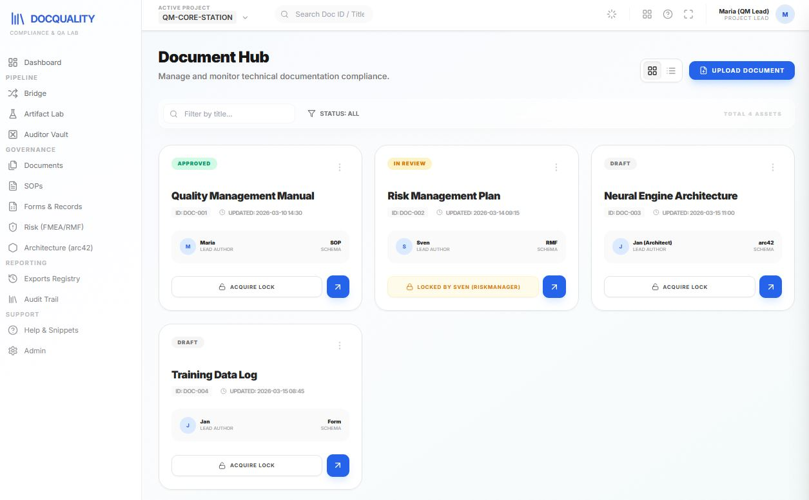

# Compliance and Quality Check of Technical and Product Software Documentation

AI-assisted compliance and quality assurance platform for software documentation.

## Business context summary

Software teams in regulated or audit-heavy environments (healthcare, fintech, enterprise SaaS or critical infrastructure) often lose significant time during releases because documentation quality and compliance checks are manual, inconsistent and late in the delivery cycle.

The **Doc Quality Compliance Checker** addresses this by introducing a structured, workflow-oriented system that:

- checks technical documents against governance and quality standards,
- improves consistency across SOP, architecture, and risk artifacts,
- shortens review cycles for QA, compliance, and audit teams,
- reduces release risk by surfacing gaps earlier,
- provides better traceability for approvals and governance decisions.

### Primary business value

- **Faster readiness for audits and reviews** through standardized evidence quality.
- **Lower operational risk** by detecting non-compliance before release gates.
- **Higher team productivity** by reducing repetitive manual document checks.
- **Stronger governance visibility** for product leads, QA, and compliance stakeholders.

## Product snapshot

Attached browser-page view of the Document Hub:

