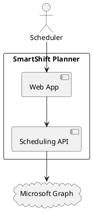
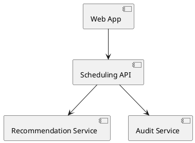
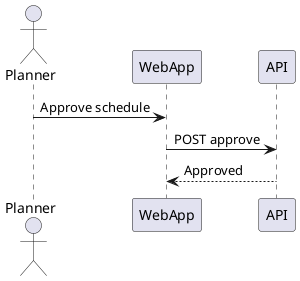

# arc42 Architecture Documentation: SmartShift Planner

**Project/System:** SmartShift Planner 
**Version:** 1.1 
**Date:** 2026-05-17 
**Authors:** Architecture QA Team 
**Status:** Draft 

---

## 1. Introduction and Goals

SmartShift Planner is a workforce scheduling platform for regulated service operations.

### 1.1 Requirements Overview

| Priority | Requirement | Description |
|----------|------------|-------------|
| 1 | Controlled scheduling | Produce compliant schedule proposals with human approval |
| 2 | Auditability | Preserve decision traceability and evidence |

### 1.2 Quality Goals

| Priority | Quality Attribute | Motivation |
|----------|------------------|------------|
| 1 | Security | protect schedules and workforce data |
| 2 | Reliability | keep schedule publication stable |
| 3 | Maintainability | evolve policy and rule logic safely |

### 1.3 Stakeholders

| Role | Name | Expectations |
|------|------|-------------|
| Operations Manager | Sample role | compliant staffing outcomes |
| Quality Manager | Sample role | auditable release evidence |

---

## 2. Constraints

- GDPR-aligned data minimization and retention
- ISO/IEC 27001-aligned security controls
- Managed Microsoft Graph interface usage only

---

## 3. Context and Scope

### 3.1 Business Context

Schedulers provide demand and availability. Recommendation service proposes rosters. Human approvers confirm publication.

**System context diagram:**

### 3.2 Technical Context

| Channel | Technology | Protocol | Description |
|---------|-----------|---------|-------------|
| Web | Next.js | HTTPS | Planner and reviewer UI |
| API | FastAPI | HTTPS | Scheduling and approval workflows |

---

## 4. Solution Strategy

- enforce policy checks before recommendation publication
- require human approval for final schedule publication
- persist immutable audit evidence for review decisions

---

## 5. Building Block View

**Component diagram:**

---

## 6. Runtime View

Scenario: planner approves a candidate schedule.

**Sequence diagram:**

---

## 7. Deployment View

- web tier, API tier, and managed data tier are separated
- encrypted traffic and managed secrets are mandatory

---

## 8. Concepts

- zero-trust access and least privilege
- tenant isolation and immutable audit records
- resilient publication with retries and idempotency keys

---

## 9. Architecture Decisions

- use managed Graph integration instead of endpoint automation
- keep recommendation generation separate from approval execution

---

## 10. Quality Requirements

| ID | Quality Attribute | Scenario | Measure | Target |
|----|------------------|----------|---------|--------|
| QS-01 | Security | unauthorized cross-tenant access | access test | blocked |
| QS-02 | Reliability | sync retry after transient error | recovery time | within SLA |

---

## 11. Risks and Technical Debt

- potential recommendation bias drift
- rate limits on calendar integration during peak usage
- need expanded fairness dashboard coverage

---

## 12. Glossary

- Explanation bundle: rationale package for recommendation decisions.
- Residual risk: risk remaining after control measures.