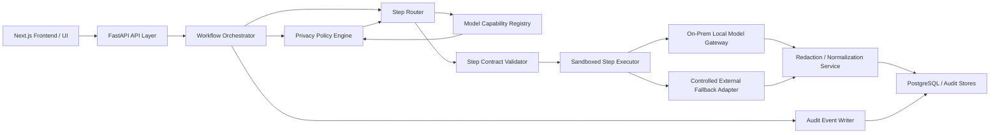
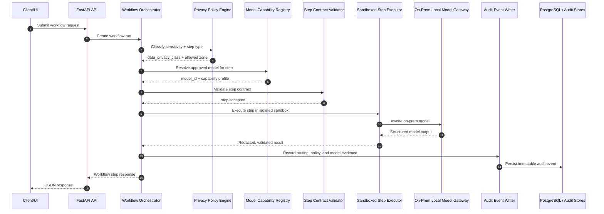

<!-- markdownlint-disable MD040 MD060 MD032 MD022 MD058 MD034 -->
# System Architecture Document (SAD) — Doc Quality Compliance Check

**Product:** Document Quality & Compliance Check System  
**Version:** 0.8.3  
**Date:** 2026-4-4  
**Author persona:** `@system-arch`  
**Standard:** ISO/IEC/IEEE 42010:2022 — Architecture Description  
**AAMAD phase:** 1.define  

---

## Section 1 – MVP Architecture Philosophy & Principles

### 1.1 Guiding Principles

This architecture follows the **KISS principle** (Keep It Simple, Stupid) for MVP delivery, with explicit documented paths toward more complex architectures in subsequent phases.

| Principle | Application in This System |
|-----------|---------------------------|
| **KISS** | Synchronous service calls; no message queues; filesystem for report storage in MVP |
| **Single Responsibility** | Each service class/module has exactly one domain (analysis, compliance, generation, templates, workflow) |
| **Dependency Inversion** | Services receive typed Pydantic models, not raw strings or dicts |
| **Graceful Degradation** | LLM enrichment is optional; rule-based core is self-sufficient |
| **Security by Default** | bleach sanitisation, filename validation, and file size limits applied at API boundary, not deep in services |
| **Observability First** | structlog structured JSON logging in every service function, not just error paths |
| **Layered Validation** | Deterministic task guardrails run first; a provider-neutral model validator performs a second-pass review over final crew output |

### 1.2 Quality Model — ISO/IEC 25010:2023

The architecture is designed to satisfy the following ISO 25010 quality characteristics in priority order:

1. **Functional Suitability** — Core PRD P0 capabilities are implemented; remaining gaps are concentrated in partial UI wiring and broader end-to-end test coverage
2. **Security** — BSI Grundschutz baseline; GDPR-compliant logging; OWASP Top 10 mitigations
3. **Maintainability** — Full type hints, Pydantic v2 models, modular service layer, pytest suite
4. **Performance Efficiency** — <3s document analysis, <10s PDF generation (synchronous, single instance)
5. **Reliability** — Structured error handling; graceful LLM degradation; 100% test pass rate

### 1.3 EU AI Act Art. 11 as an Architectural Constraint

EU AI Act Art. 11 + Annex IV require that high-risk AI providers draw up technical documentation **before** placing the AI system on the market. This constraint directly shapes the architecture:

- arc42 completeness checking is the primary document analysis flow (not a secondary feature)
- The HITL workflow is a mandatory design element, not optional post-processing
- structlog JSON logs provide the Art. 12 logging capability requirement
- Generated PDF reports are designed for audit submission (not just internal use)
- The SOP templates directly map to Annex IV technical documentation sections

### 1.4 HITL as a Mandatory Design Constraint

Human-In-The-Loop review is treated as a **first-class architectural component**, not a UI affordance. This means:
- All AI-generated assessments produce a `ReviewRecord` object, not just a free-form result.
- **Traceability of Actions:** Every review, modification request, and fix must be stored with a specific **Action Date** and the **Identity (Name/ID)** of the person performing the task.
- Review verdicts (`pass` | `modifications_needed`) are persisted with timestamps and reviewer metadata.
- **Closed-Loop Fixes:** Modification requests are linked to specific remediations, creating an auditable trail of "Issue -> Request -> Fix -> Re-approval".
- **Role Rules:**
  1. Implementer and reviewer must not be the same person.
  2. High risk products or high risk complaints require a third person for approval.
  3. All HITL participants are part of the QM department; for high risk products/issues, a certified Riskmanager should be responsible for risk management and approval.
  4. For high risk aspects, top management must be informed; by law, they hold main responsibility for QM and governance.
  5. For technical SW documents (e.g., arc42), internal review shall be performed by the development department (Senior SW engineers, SW architects, SW testers, DevOps, etc.), depending on the document's focus. After internal approval it will be send to the QM department for additional review necessary for being auditable.
  6. HITL participant takes care of cost control information regarding model selection and usage.
- The audit trail of review decisions is itself a compliance artefact for EU AI Act Art. 14

#### Model Selection and Cost Control

All models used in implementation—including classical ML, LLMs, vLMs, and MoE concept models—must be cost controlled:

- Model selection considers both performance and operational cost (compute, storage, inference, licensing).
- Cost control mechanisms include:
  - Usage quotas and rate limits for LLM/vLM/MoE APIs.
  - Preference for open-source or on-premise models where feasible.
  - Monitoring and logging of model invocation frequency and resource consumption.
  - Automated alerts for cost threshold breaches.
  - Periodic review of model cost/performance trade-offs.
- Model usage policies are documented and enforced in code and architecture.
- Cost control aligns with compliance, audit, and sustainability requirements.

### 1.5 Risk Management Documentation Requirements

The system must support two distinct types of risk management documentation:

- **General Risk Management Record (Company-wide):**
  - Follows the structure of Table 1 (Riskmanagement File).
  - Covers topics such as risk management process, responsibilities, staff qualifications, risk management plan, intended use, hazardous situations, risk assessments, risk mitigations, completeness, assessed total risk, risk management report, and post-market phase.
  - Links to other documents required for audits and certification.

- **Product-Specific Risk Management Record:**
  - Follows the structure of Table 2 (Documentation of specific Product Risk-Handling).
  - Tracks risk analysis and mitigation for each product, including severity, probability, risk mitigation, verification, and new risks.
  - Supports traceability for high-risk products as required by EU AI Act and notified body audits.

Both document types must be:
- Created, updated, and approved via HITL workflow (with timestamps and responsible person).
- Linked to technical templates (e.g., arc42) and QM-specific documentation.
- Ready for external audits and ISO certification.

#### Risk Document Handling Process (EU AI Act Alignment)

References: [EU AI Act Article 9](https://artificialintelligenceact.eu/article-9-risk-management-system/), [Article 11](https://artificialintelligenceact.eu/article-11-technical-documentation/), [Annex IV](https://artificialintelligenceact.eu/annex-iv/), [Article 14](https://artificialintelligenceact.eu/article-14-human-oversight/)

1. **Ownership**
   - **Company-wide Risk Management Record:** Owned and maintained by the QM department (Quality Manager or certified Riskmanager).
   - **Product-specific Risk Management Record:** Owned by the product team (Product Owner, QM, and certified Riskmanager for high-risk products).

2. **Linking**
   - Each product-specific risk record must reference the company-wide risk management record for context and compliance alignment.
   - All risk records link to supporting documents (SOPs, audit reports, technical templates).

3. **Updating**
   - Updates are initiated by the responsible owner (QM or Product Owner).
   - All changes are versioned, timestamped, and attributed to the editor.
   - For high-risk products/issues, updates require review and approval by a certified Riskmanager.

4. **Approval**
   - Standard risk records: Approval by QM or Product Owner.
   - High-risk records: Approval by certified Riskmanager and notification to top management.
   - All approvals are logged with date, approver identity, and linked evidence.

5. **Traceability**
   - Every action (create, update, approve) is recorded in the audit trail.
   - All records are stored in PostgreSQL with links to related documents and version history.
   - For high-risk, escalation and notification to top management is mandatory.

| Document Type | Owner | Reviewer/Approver | Traceability |
|---------------|-------|-------------------|--------------|
| Company-wide Risk Record | QM / Riskmanager | QM / Riskmanager | Audit trail, version history |
| Product-specific Risk Record | Product Owner / QM | QM / Riskmanager (high-risk) | Audit trail, version history, links to company-wide record |
| High-risk Product/Issue | Product Owner / QM / Riskmanager | Riskmanager, Top Management | Audit trail, version history, escalation log |

### 1.6 Security Requirements

The system must address the following security requirements:

1. **OWASP Top 10 AI Security:**
   - All relevant OWASP Top 10 AI security risks must be mitigated (e.g., prompt injection, insecure model usage, data leakage, supply chain vulnerabilities).
   - Security controls and input validation must be implemented at API boundaries and agent interfaces.

2. **Secure Execution Environment:**
   - All agents must run in a sandboxed environment to prevent unauthorized access and privilege escalation.
   - The application must be deployed in a secure infrastructure (e.g., containerized, restricted network access).

3. **User Authentication & Authorization:**
   - The system must enforce user authentication and role-based authorization for all access to sensitive features and data.
   - Audit logs must record user actions for traceability.

4. **Testing Before Release:**
   - All releases must pass unit tests, integration tests, and user acceptance tests before deployment.
   - Test coverage and results must be documented and reviewed as part of the release process.

5. **Prompt Versioning & Traceability (Mandatory):**
    - All LLM prompts must be stored as versioned files under a dedicated `prompts/` directory.
    - Inline prompt strings in production agent code are not allowed, except for short test fixtures.
    - Prompt changes must be traceable (version identifier + change rationale) to support auditability and reproducibility.

6. **OCR Fallback & Extraction Quality Monitoring (Mandatory):**
    - For scanned/low-quality PDFs and image-heavy documents, OCR fallback must be applied when text-layer extraction confidence is below threshold.
    - OCR processing must follow a SOTA pipeline: **transcribe + structure + grounding** (layout anchors / bounding-box awareness) to preserve reading order and reduce hallucinations.
    - OCR model selection must be output-format-first: DocTags/HTML (reconstruction), Markdown+captions (LLM QA), JSON (programmatic extraction).
    - Extraction quality must be monitored with both public benchmark sanity checks and a domain micro-benchmark (including tables, multilingual pages, low-DPI scans, and field-level accuracy checks).

7. **Persistence Scaling & Archival Governance (Mandatory):**
    - Auditability data must use an append-only event log as the system-of-record, plus materialized current-state tables for operational UX.
    - Immutable snapshots must be generated periodically (e.g., nightly and workflow completion) to bound reconstruction cost for long-lived cases.
    - Retention must be policy-driven with hot/warm/cold tiers, legal-hold override, and redaction controls per tenant/project.
    - PostgreSQL storage must use time-based partitioning and targeted indexes for investigation queries; index design must balance write throughput and read latency.
    - Cold archival must use compliance-grade exports (e.g., Parquet + manifest + checksum) with retrievability and integrity verification.
    - Agentic traceability must preserve provenance metadata (`trace_id`/`correlation_id`, actor, subject, prompt/template version, model/provider metadata) and separate long-retention audit events from short-retention telemetry.

#### Security Requirements Implementation & Review Process

1. **Implementation**
   - **SW Engineers:** Implement security controls (OWASP Top 10, input validation, sandboxing, authentication/authorization) in application code.
   - **Test Engineers:** Develop and execute unit tests, integration tests, and user acceptance tests focused on security features.

2. **Review**
   - **Security Reviewer:** Reviews test results, code, and configurations for compliance with security requirements and standards.
   - **DevOps Engineer:** Validates integration and deployment security, ensures sandboxing and secure infrastructure, reviews logs and audit trails.

3. **Traceability**
   - All security-related tasks and reviews are documented and auditable.
   - Release is approved only after successful review and test completion.

| Task | Responsible | Reviewer |
|------|-------------|----------|
| Security controls implementation | SW Engineer | Security Reviewer |
| Security testing (unit/integration/UAT) | Test Engineer | Security Reviewer |
| Integration & deployment security | DevOps Engineer | Security Reviewer, DevOps |

### 1.7 Hybrid Agentic Decision Framework

The system architecture supports a hybrid agentic decision framework combining automated agents and HITL (Human-In-The-Loop) roles for compliance-critical workflows. This ensures both efficiency and regulatory traceability, especially for high-risk and audit-sensitive operations.

#### Framework Overview
- **Automated Agents:**
  - Execute routine compliance checks, document analysis, and risk scoring using AI models (FastAPI, Pydantic, structlog). Inform app user or defined QM person about this routine compliance checks, document analysis and risk scoring. For MVP, a list of clickable topics on a 'History View' page is enough getting information about automated work.
  - Operate within defined boundaries, with all actions logged and versioned.
  - Trigger HITL review gates for unclear, ambiguous, high-risk, or regulatory-sensitive cases. Don't hallucinate.

- **HITL Roles:**
  - Review, approve, and override agent decisions for compliance, risk, and security documentation.
  - Responsible for final approval of high-risk actions, risk document updates, and regulatory submissions.
  - All HITL actions are logged with timestamps, identity, and evidence links.

- **Escalation and Notification:**
  - High-risk or unresolved cases are escalated to certified Riskmanager and product management which have to inform top management.
  - Escalation logs are maintained for audit and traceability.

#### Decision Flow
1. **Routine Operation:**
   - Automated agents process documents and flag issues.
   - Low-risk issues are auto-resolved and logged.
   - If low-risk issue is unclear, trigger HITL process. Don't hallucinate.
2. **Ambiguous/High-Risk Case:**
   - Agent triggers HITL review gate.
   - HITL reviews, approves, or escalates as needed.
3. **Escalation:**
   - Certified Riskmanager/top management review and approve.
   - All actions recorded in audit trail.

#### Traceability and Compliance
- All agentic and HITL actions are versioned and auditable.
- Framework aligns with EU AI Act Article 14 (Human Oversight), ISO 25010, and ISO 42010.
- HITL review gates are configurable per workflow and risk level.
- Audit logs are stored in PostgreSQL and linked to relevant documents.

#### Table: Agentic vs HITL Roles
| Workflow Step | Automated Agent | HITL Role | Escalation |
|---------------|-----------------|-----------|------------|
| Routine Compliance Check | Yes | Optional | No |
| Risk Document Update | Yes | Yes | Yes (high-risk) |
| Security Review | Yes | Yes | Yes (critical) |
| Regulatory Submission | No | Yes | Yes |
| Audit Trail Logging | Yes | Yes | Yes |

### 1.8 Change Request — Data Privacy CR-2026-05-16 (Risk 1 Mitigation)

**Risk addressed:** Risk 1: External model transfer of potentially personal prompt/output data.

**Architecture decision:** For production workflows that may contain direct or inferred personal data, inference is executed on internal on-prem models. External model providers are treated as controlled fallback paths for scrubbed/non-personal requests only.

#### 1.8.1 Sensitive Data Classification and Controls

| Sensitive Data | Category | Exposure Risk | Architecture Controls (Target State) |
|----------------|----------|---------------|--------------------------------------|
| Prompt context and model output content | Direct/inferred personal data in model I/O | Third-party disclosure during external inference | On-prem inference default, prompt minimization, redaction before persistence/export, policy-based routing deny for external calls |
| Provider/model telemetry and rich trace payload | Actor/workflow metadata and content fingerprints | Re-identification and profiling when combined with audit records | Telemetry stratification (operational vs audit), strict RBAC, field-level masking, short retention for rich traces |
| Model credentials and routing configuration | Secrets and control-plane config | Unauthorized model use or data exfiltration | Managed secrets store, key rotation, least-privilege access, audited configuration changes |

#### 1.8.2 Architecture Delta

1. **Routing policy hardening**
  - Introduce mandatory `data_privacy_class` routing input (`personal_data_possible`, `non_personal`, `scrubbed_fallback`).
  - Enforce policy: `personal_data_possible` -> `on_prem_required`.

2. **Provider adapter governance**
  - Keep adapter abstraction, but classify external adapters as fallback-only for approved flows.
  - Persist routing decision evidence (`selected_inference_location`, `policy_rule_id`, `decision_reason`) in audit events.

3. **Observability segregation**
  - Separate stores/retention classes for:
    - compliance-grade audit evidence,
    - operational telemetry,
    - temporary rich traces for incident/debug windows.
  - Disallow unrestricted prompt/output snapshots in long-retention telemetry tables.

4. **Secrets and control plane hardening**
  - Move provider keys and routing controls to managed secret/config services with rotation.
  - Require dual-control approval for routing-policy changes that allow external fallback.

#### 1.8.3 Migration Plan (On-Prem Substitution)

1. **Phase A: Guardrails first**
  - Mark and route all personal-data-capable workflows to on-prem path.
  - Add policy-deny behavior for non-compliant external routing attempts.

2. **Phase B: Controlled fallback**
  - Allow external fallback only for scrubbed requests and explicit incident/runbook scenarios.
  - Capture fallback reason codes for compliance review.

3. **Phase C: Steady-state privacy posture**
  - On-prem becomes default and expected path for production governance workflows.
  - External usage remains exception-based, auditable, and periodically reviewed by security/compliance.

#### 1.8.4 Verification Requirements

- Architecture conformance tests must fail if `personal_data_possible` requests are routed externally.
- Audit trail must include routing and policy decision metadata for every model invocation.
- Retention and access checks must validate least-privilege visibility for telemetry and traces.
- Secret rotation and access logs must be verifiable in release governance evidence.

#### 1.8.5 Step Contract + Sandbox Pattern

The target architecture improves privacy and control by turning broad business workflows into isolated, policy-scoped step executions. Each step is a contract, not an implicit prompt blob.

**Step execution contract**

| Contract Item | Architectural Rule |
|---------------|--------------------|
| Step identity | Every step has a stable `step_id` and business meaning |
| Input contract | Strict versioned schema, minimal required fields only |
| Output contract | Structured response, validated before downstream use |
| Policy context | Sensitivity and routing class must be explicit |
| Tool boundary | Allowlisted tools only; no direct DB or unrestricted network access |
| Sandbox boundary | Isolated runtime per step with denied egress by default |
| Validation | Schema, redaction, and policy checks before persistence |
| Retry semantics | Only the failed step retries, not the full workflow |

**Sandbox mechanics**

- Run model calls in a sandbox with no default outbound internet access.
- Mount only the minimum internal data required for the specific step.
- Inject secrets only when the step policy explicitly authorizes them.
- Prefer local model invocation endpoints on the same internal trust zone.
- Persist only redacted outputs and structured step metadata in long-retention stores.

**Why this is an architectural improvement**

- It reduces the blast radius of any one model call.
- It keeps personal data closer to the application boundary.

#### 1.8.6 Bridge Startup Runtime Self-Check Gate (Implemented)

To prevent bridge execution on schema-drifted or policy-inconsistent runtimes, a mandatory startup/runtime gate is implemented.

**Endpoint**
- `GET /api/v1/bridge/runtime/self-check`

**Purpose**
- Report migration drift and schema readiness before a bridge run starts.
- Explicitly verify required bridge tables (including `model_policy_configs`) and required columns.
- Verify model-runtime policy for each bridge agent step.

**Checked controls**
1. Database migration state (`alembic_version` vs code migration head) on PostgreSQL runtimes.
2. Required bridge tables and columns:
  - `hitl_reviews`, `skill_documents`, `document_locks`, `skill_findings`, `audit_events`, `user_sessions`, `quality_observations`, `governance_controls`, `model_policy_configs`, `stakeholder_profiles`, `stakeholder_employee_assignments`.
3. Per-agent model locality:
  - Inspection, Compliance, Research, and Quality Gate each must resolve to local `ollama` execution and local processing.

**Enforcement**
- `POST /api/v1/bridge/run/eu-ai-act` executes the same self-check before run start.
- If self-check fails, bridge run is blocked with explicit remediation details.

#### 1.8.7 Agent Model Locality Policy (Implemented)

For privacy-sensitive bridge workflows, each bridge agent is required to use a local `ollama` model runtime:

1. Inspection Agent -> local `ollama` model.
2. Compliance Agent -> local `ollama` model.
3. Research Agent -> local `ollama` model.
4. Quality Gate Agent -> local `ollama` model.

This requirement is both:
- policy enforced in runtime checks and bridge execution guardrails,
- auditable through sandbox-step metadata and startup self-check responses.
- It supports swapping local models per step without redesigning the whole workflow.
- It makes validation and audit simpler because each step has an explicit contract and evidence trail.

**Architectural consequence**

The orchestrator becomes a policy-driven step router, not just a chain-of-prompts engine. That change is important because it lets the system assign the smallest capable local model to each step while preserving privacy boundaries and explainability.

#### 1.8.6 On-Prem Model Capability Registry + Migration KPIs

The architecture shall maintain a registry of approved on-prem models and use it as the source of truth for routing decisions.

**Capability registry content**

| Registry Field | Purpose |
|---------------|---------|
| `model_id` | Unique internal model identifier |
| `deployment_zone` | On-prem, internal cloud, or external fallback |
| `step_types` | Approved workflow steps |
| `sensitivity_classes` | Allowed data categories |
| `context_window` | Token/context limit |
| `format_support` | JSON, tool calling, streaming, citations |
| `quality_score` | Benchmark result for the approved step set |
| `latency_p95` | Routing and SLO planning input |
| `resource_profile` | CPU/GPU/memory expectations |
| `approval_status` | Experimental, approved, deprecated |
| `review_date` | Last benchmark and compliance review |

**Migration KPIs**

| KPI | Architectural Target |
|-----|----------------------|
| On-prem coverage for privacy-sensitive steps | High and increasing |
| External fallback frequency | Low, exceptional, and decreasing |
| Step validation success rate | High and stable for approved steps |
| Reviewer override rate | Low enough to justify automation |
| Privacy leakage incidents | Zero for production traffic |
| Registry freshness | Within the required review cadence |

**Migration governance rules**

1. A model may not be used for a step until it is benchmarked against that exact step contract.
2. Local model promotion requires privacy, quality, and latency sign-off.
3. External fallback requires an explicit exception reason, audit entry, and retention controls.
4. The orchestrator must refuse to route privacy-sensitive requests to any model not listed in the approved registry.

**Design benefit**

This turns the privacy migration from a one-time platform change into a controlled capability-management process with measurable evidence.

#### 1.8.7 GDPR Data Guardrails and Lookup Tables

The architecture must treat both standard PII and special category personal data as first-class policy inputs before any model step executes.

**Mandatory sensitive-data dictionaries (lookup tables)**

| Dictionary / Lookup Table | Purpose | Minimum Fields |
|---------------------------|---------|----------------|
| `pii_type_catalog` | Canonical taxonomy for common identifiers | `pii_type_id`, `name`, `examples`, `risk_level`, `default_action` |
| `special_category_catalog` | GDPR Art. 9 special category data taxonomy | `category_id`, `name`, `legal_basis_required`, `default_action`, `review_gate` |
| `pattern_rule_catalog` | Detection rules for direct identifiers and account numbers | `rule_id`, `pii_type_id`, `pattern_type`, `pattern_reference`, `confidence_weight` |
| `entity_detector_catalog` | NER/detector mapping for inferred identifiers (name, address, health entities) | `detector_id`, `supported_types`, `model_or_rule`, `threshold` |
| `policy_action_matrix` | Decision table from data class + purpose to allowed action | `data_class`, `processing_purpose`, `allowed_zone`, `required_controls`, `deny_reason` |
| `retention_policy_catalog` | Storage limitation controls by payload class | `payload_class`, `retention_class`, `ttl_days`, `storage_tier`, `deletion_mode` |
| `dsr_action_catalog` | Data-subject-right action playbooks | `right_type`, `sla_days`, `required_artifacts`, `processor_steps`, `approval_role` |
| `cross_border_transfer_policy` | Transfer restriction policy for external fallback | `destination_zone`, `allowed_data_class`, `required_safeguard`, `approval_required` |

**Baseline PII coverage requirements**

- The dictionary set must classify at least: full name, home address, email address, social security number, driver license number, financial account numbers, passport numbers, biometric identifiers, and derived identity signals.
- Special category coverage must include: racial or ethnic origin, political opinions, religious or philosophical beliefs, trade union membership, genetic data, biometric data for unique identification, health data, sex life, and sexual orientation.

**Step-level privacy guardrails (mandatory order)**

1. **Classify:** Detect PII/special-category entities using pattern and entity lookup tables.
2. **Purpose-check:** Verify lawful purpose and purpose limitation against `policy_action_matrix`.
3. **Minimize:** Remove non-essential fields and chunk context to least-necessary scope.
4. **Protect:** Apply tokenization/masking/redaction by data class policy.
5. **Route:** Enforce local on-prem execution for restricted classes; deny or quarantine on policy violation.
6. **Validate:** Check structured output for leakage patterns and policy breaches.
7. **Persist:** Store only approved redacted payload classes with TTL from retention catalog.
8. **Audit:** Record policy decision, controls applied, and legal/purpose rationale.

**GDPR principles mapped to architecture controls**

| GDPR Principle | Architectural Control |
|----------------|------------------------|
| Lawfulness, Fairness, Transparency | Policy decision records include lawful basis reference and user-facing processing explanation metadata |
| Purpose Limitation | Per-step purpose tags enforced by `policy_action_matrix`; out-of-purpose processing denied |
| Data Minimization | Contract-driven field allowlists and context chunking before inference |
| Accuracy | Entity/detector confidence thresholds with HITL review for low-confidence classification |
| Storage Limitation | Retention catalog with automated TTL deletion and legal-hold override controls |
| Integrity and Confidentiality | Encryption, RBAC, sandbox isolation, egress deny-by-default, secret rotation |
| Accountability | Immutable audit events and periodic conformance reporting |

#### 1.8.8 Data Subject Rights Guardrails (GDPR Articles 15, 16, 17, 18, 20, 21)

The privacy architecture must include operational paths and auditability for data-subject rights.

| Right | Architectural Requirement |
|-------|---------------------------|
| Access (Art. 15) | Provide traceable export of personal-data records and model-processing metadata by subject identifier |
| Rectification (Art. 16) | Support correction workflow with versioned updates and downstream reprocessing markers |
| Erasure (Art. 17) | Execute deletion orchestration across operational stores, telemetry classes, and derived indexes where legally required |
| Restrict Processing (Art. 18) | Enforce per-subject processing lock flags checked by step router before model invocation |
| Data Portability (Art. 20) | Provide structured export format with provenance and field dictionary |
| Object (Art. 21) | Register objection flags and deny non-exempt processing paths automatically |

**DSR guardrail implementation rules**

- Every DSR request must create a case record with SLA, state transitions, and evidence artifacts.
- Model step execution must check subject restriction/objection flags before processing.
- Erasure and restriction outcomes must propagate to caches, embeddings, and search indexes.
- DSR operations must be auditable without exposing sensitive payload content.

**Verification requirements for GDPR guardrails**

- Detection tests must cover direct identifiers, quasi-identifiers, and special category data examples.
- Routing tests must prove denied external transfer for restricted classes.
- Retention tests must verify TTL enforcement and legal-hold exceptions.
- DSR tests must validate access, rectification, erasure, restriction, portability, and objection workflows end-to-end.

---

## Section 2 – Stakeholders and Concerns

| Stakeholder | Primary Concerns | Architectural Viewpoints |
|-------------|-----------------|-------------------------|
| **Quality Manager (Maria)** | Documents meet EU AI Act compliance standards; audit reports are downloadable PDF; HITL review trail is auditable; employee assignments to governance roles are persisted and queryable for audit evidence | Functional, Process, Deployment |
| **Riskmanager (Sven)** | Responsible for high-risk product/issue risk management and approval; ensures compliance with EU AI Act and ISO standards; maintains audit trail and escalation logs; member of QM department | Functional, Process, Data |
| **System Architect (Jan)** | arc42 sections complete; UML diagrams present; modification requests are actionable; observability telemetry shows per-component latency and quality signal | Functional, Logical |
| **Compliance Auditor (Elke)** | EU AI Act requirements correctly assessed; risk level classification is accurate; HITL trail demonstrates Art. 14 compliance; stakeholder role assignments are evidence-quality records | Functional, Data |
| **Technical Service / Admin** | AI quality telemetry (workflow component breakdown, GenAI trace payloads, Prometheus snapshot) is accessible in the Admin Observability page; demo mode ensures the page works during demonstrations before production telemetry flows are active | Operational, Monitoring |
| **Developer / ML Engineer** | SOP templates provide clear guidance; modification requests are specific (section + priority + description) | Functional |
| **DevOps / Project Manager** | Deployment is simple (single `uvicorn` command); logging is structured; security is hardened; tests all pass | Deployment, Process |
| **Security Reviewer** | No secret storage in code; XSS prevented; filename validation; no PII in logs | Security (cross-cutting) |

---

## Section 3 – Architectural Views

### 3.1 Logical View

The system is decomposed into five logical layers:

```
┌─────────────────────────────────────────────────────────────┐
│                  Presentation Layer                          │
│        (Next.js Multi-Page React/TypeScript Frontend)        │
│ [Doc Hub] [Dashboard] [Bridge] [Artifact Lab] [Admin Center] │
│                                                             │
│   Goal: The multi-page frontend is designed to fulfill trust, clarity, traceability, and speed—while feeling modern and uplifting. The visual style uses a white-blue-green colour palette to evoke trust, calm, and progress. Dark mode is currently not implemented and is treated as an optional future topic (not a mandatory MVP requirement). Detailed UI requirements will be clarified later; for now, the mood-enhancing style and UX principles are prioritized.
│                                                             │
│   After login, the first page presents a left navigation pane with the following elements:
│     - Home (Doc Hub)
│     - Compliance Standards
│     - Dashboard
│     - Bridge
│     - Artifact Lab
│     - Auditor Vault
│     - SOPs
│     - Risk (FMEA / RMF)
│         - Risk actions currently use a backend-first client with demo fallback on legacy endpoint failure.
│         - CSV export exists on the backend risk-template surface.
│     - Architecture (arc42)
│     - Exports Registry
│     - Audit Trail
│     - Auditor Workstation
│     - Help & Snippets
│         - Includes Help, Q&A, and Glossary routes in the current pages router.
│     - Admin
│         - Observability
│         - Stakeholders & Rights
│         - Model Policy & Parameters
│         - Compliance Controls (Governance)
│                                                             │
│   fetch() → /api/v1/* endpoints                       │
└─────────────────────────────┬───────────────────────────────┘
                              │ HTTP/REST (JSON)
┌─────────────────────────────▼───────────────────────────────┐
│                   API Layer (FastAPI)                        │
│  /api/v1/documents    /api/v1/compliance                     │
│  /api/v1/reports      /api/v1/templates                      │
│  Pydantic v2 request validation + response serialisation     │
│  bleach sanitisation + filename/size validation at boundary  │
└──────┬──────────────────┬──────────────┬────────────────────┘
       │                  │              │
┌──────▼──────┐  ┌────────▼──────┐  ┌───▼──────────────────┐
│  Document   │  │  Compliance   │  │  Template / Report    │
│  Analyzer   │  │  Checker      │  │  / HITL Services      │
│  Service    │  │  Service      │  │                       │
│             │  │               │  │  TemplateManager      │
│  analyze_   │  │  check_eu_    │  │  ReportGenerator      │
│  document() │  │  ai_act_      │  │  HitlWorkflow         │
│             │  │  compliance() │  │                       │
└──────┬──────┘  └────────┬──────┘  └──────────┬────────────┘
       │                  │                    │
       │                  │          ┌─────────▼────────────┐
       │                  │          │   Persistence Layer   │
       │                  │          │                      │
       │                  │          │  - PostgreSQL (P0)   │
       │                  │          │  - Audit Logs (Art12)│
       │                  │          └──────────────────────┘
       │                  │
┌─────────────────────────────────────────────────────────────┐
│           Execution / Skills API (Safe Runtime)            │
│  document retrieval • parsing • exports • DB writes        │
│  guardrails/redaction • allowlisted tools • rate limits    │
└─────────────────────────────────────────────────────────────┘
                              │
┌─────────────────────────────────────────────────────────────┐
│      AI Agent Layer + Hybrid CrewAI Orchestration          │
│   DocumentCheckAgent          ComplianceCheckAgent          │
│   - wraps DocumentAnalyzer   - wraps ComplianceChecker      │
│   - optional LLM call        - optional LLM call            │
│   - structured prompt        - structured prompt            │
│   - result parsed to model   - result parsed to model       │
│                                                             │
│   CrewAI Orchestrator                                       │
│   - workflow brain for multi-step runs                      │
│   - retries / branching / verifier gates                    │
│   - emits run/step audit events                             │
└─────────────────────────────────────────────────────────────┘
                              │
                 [Model Provider Adapter Layer]
      (AnthropicAdapter | OpenAICompatibleAdapter | NemotronAdapter)
                    (may be optional, graceful fallback)
```

### 3.1.1 SOLID-Oriented Privacy Architecture

The target architecture should follow SOLID principles so the privacy-sensitive on-prem migration remains maintainable, testable, and extensible.

**SOLID mapping**

| Principle | Architectural application |
|----------|----------------------------|
| Single Responsibility | Each component has one reason to change: routing, policy, model execution, redaction, audit, or persistence |
| Open/Closed | New local models are added through registry entries and adapters, not by changing orchestration logic |
| Liskov Substitution | Every model adapter and step executor must satisfy the same contract so the orchestrator can swap implementations safely |
| Interface Segregation | Separate interfaces for routing, inference, validation, sandboxing, and audit writing avoid fat abstractions |
| Dependency Inversion | The orchestrator depends on policy and model-execution interfaces, not concrete providers or deployment details |

**Quality engineering best practices**

- Prefer explicit interfaces, typed schemas, and small services over monolithic agent code.
- Keep privacy policy evaluation separate from model execution so the same policy can govern multiple local models.
- Treat local model invocation as a bounded capability, not a free-form SDK call.
- Keep validation deterministic and provider-neutral so local and fallback paths produce comparable evidence.
- Make every cross-cutting concern observable through structured audit events and redacted telemetry.

**Main component diagram**



**Component responsibilities**

| Component | Responsibility | SOLID emphasis |
|-----------|----------------|-----------------|
| Privacy Policy Engine | Classifies sensitivity and decides allowed execution zone | SRP, DIP |
| Step Router | Routes each business step to an approved execution target | OCP, DIP |
| Model Capability Registry | Stores approved models, task scopes, and benchmark metadata | SRP, OCP |
| Step Contract Validator | Enforces schema, allowed tools, and output contract | SRP, ISP |
| Sandboxed Step Executor | Runs each step with isolated resources and no default egress | SRP, LSP |
| On-Prem Local Model Gateway | Serves local inference behind a stable adapter contract | LSP, DIP |
| Controlled External Fallback Adapter | Provides exception-only external inference path | LSP, OCP |
| Redaction / Normalization Service | Minimizes and sanitizes prompt/output payloads before storage | SRP |
| Audit Event Writer | Writes immutable model-routing evidence and policy decisions | SRP |

**Design rules**

- Business workflows must be split into step contracts before any model execution.
- Personal-data-capable steps default to the local model gateway.
- External fallback requires an explicit policy exception and a redacted payload.
- No component may access PostgreSQL directly unless it is a designated persistence service.
- No model adapter may bypass the step validator or audit writer.

### 3.1.2 Flow Pattern (CrewAI Best Practice)

**Current implementation status (Bridge orchestration and sandboxing):**

- Four bridge agent steps are explicitly modeled in code: `inspection`, `compliance`, `research`, `quality_gate`.
- Each step has a dedicated sandbox identity (`sandbox_id`) and `local_isolated`/`deny_external` execution policy metadata.
- This currently represents enforced runtime policy and auditable execution metadata, not yet a separately deployed "one container per agent" runtime topology.
- Bridge orchestration in the current codebase is implemented primarily in the `/api/v1/bridge` route/service flow (with frontend pipeline orchestration for UX step progression), not yet as a standalone `services/orchestrator/*` module stack.

**Target architecture intent:**

- The architecture still expects a dedicated orchestrator layer to coordinate the full multi-step agent workflow with explicit step contracts and runtime controls.
- A container-per-agent sandbox deployment model remains a valid target topology for future hardening phases, but is not required to claim current implementation completeness.

**Orchestration Architecture (Phase 0+):**

The orchestrator implements the **CrewAI Flow best practice pattern**:

- **DocumentReviewFlow** (`services/orchestrator/flows/document_review_flow.py`): Owns end-to-end orchestration logic
  - Resolves routing mode (single-agent vs. crew) with kill-switch and feature flags
  - Manages workflow state (run_id, trace_id, correlations)
  - Enforces global timeout via asyncio.wait_for()
  - Logs routing decisions and completion events
  - Executes a post-crew validator stage using the model adapter contract and structured JSON output
  - Dispatches to execution paths (_crew_path / _scaffold_path)
  - Returns structured WorkflowRunResponse

- **OrchestratorService** (`services/orchestrator/service.py`): Thin HTTP-facing wrapper
  - Accepts requests from FastAPI controller
  - Instantiates DocumentReviewFlow
  - Delegates all orchestration to Flow
  - Returns response to caller

- **Crew** (`services/orchestrator/crews/review_flow.py`): Reusable "team skill" called by Flow
  - Defines five specialized agents (Intake Specialist, Evidence Collector, Compliance Analyst, Report Synthesizer, Quality Verifier)
  - Executes sequential multi-agent tasks
  - Called from Flow._crew_path() in thread-pool executor
  - Agents access backend via Skills API tools only

**Crew persona matrix (concise):**

| Agent | Role | Goal | Backstory Focus |
|-------|------|------|-----------------|
| Intake | Audit Scope Senior Research Specialist | Resolve scope + validate document/metadata before analysis | Scope completeness and ambiguity reduction |
| Evidence | Document Evidence Senior Research Specialist | Extract high-signal, citation-ready evidence via Skills API | Traceable evidence quality and coverage |
| Compliance | EU AI Act Critical Reviewer and Risk Analyst | Identify policy gaps/risks and write evidence-backed findings | Skeptical assumption checks and risk focus |
| Synthesis | Senior Compliance Instructor for non-technical reviewers | Explain results clearly in structured audit package | Clarity-first communication for non-technical stakeholders |
| Verifier | Audit Package Critical Reviewer and Risk Analyst | Pass/fail final package on schema, citations, hallucination checks | Final quality gate and fail-fast rigor |

**Second-pass validator stage:**
- Task-level deterministic guardrails and schema checks in `crews/review_flow.py` remain the first reliability layer.
- `DocumentReviewFlow._crew_path()` now adds a second-pass validator stage that reviews the final crew output through the provider adapter contract.
- Validator prompts are versioned files under `services/orchestrator/src/doc_quality_orchestrator/prompts/` rather than inline workflow strings.
- Validator output is normalized to `decision`, `summary`, `issues`, and `checks`, then emitted as audit events.
- If the provider cannot return valid structured output, the stage degrades gracefully by skipping instead of failing the workflow on adapter-scaffold limitations.

**Pattern Benefits:**
- Separation of concerns: Flow owns business logic, Crew owns agent collaboration
- Reusability: Crew is a standalone skill that can be orchestrated in multiple flows
- Future extensibility: Multi-crew workflows, event triggers, and state machines can be added in Flow without changing Crew
- Auditability: Routing decisions, state transitions logged at Flow level

**Core module responsibilities:**

| Module | Responsibility |
|--------|---------------|
| `core/config.py` | `Settings` class via pydantic-settings; `get_settings()` singleton |
| `core/logging_config.py` | structlog JSON configuration; `get_logger()` factory |
| `core/security.py` | `sanitize_text()`, `validate_filename()`, `validate_file_size()` |
| `models/document.py` | `DocumentAnalysisResult`, `DocumentSection`, `DocumentType`, `DocumentStatus` |
| `models/compliance.py` | `ComplianceCheckResult`, `ComplianceRequirement`, `ProductDomainInfo`, `RiskLevel`, `AIActRole`, `ComplianceFramework` |
| `models/report.py` | `ReportResult`, `ReportMetadata` |
| `models/review.py` | `ReviewRecord`, `ModificationRequest`, `ReviewStatus`, `ReviewVerdict` |
| `services/document_analyzer.py` | `analyze_document()`, `analyze_arc42_document()`, `analyze_model_card()`, `detect_document_type()` |
| `services/compliance_checker.py` | `check_eu_ai_act_compliance()`, `determine_ai_act_risk_level()`, `detect_role()`, `get_applicable_regulations()` |
| `services/template_manager.py` | `list_templates()`, `get_template()`, `get_active_templates()` |
| `services/report_generator.py` | `generate_report()` (ReportLab PDF) |
| `services/hitl_workflow.py` | `create_review()`, `get_review()`, `update_review_status()`, `list_reviews()` |
| `services/orchestrator/` | CrewAI workflow runtime, routing, retries, verifier gate, run/step audit emission |
| `services/model_adapters/` | Provider abstraction for Anthropic, OpenAI-compatible backends, and Nemotron target integration |
| `agents/doc_check_agent.py` | `DocumentCheckAgent` — wraps service + optional LLM |
| `agents/compliance_agent.py` | `ComplianceCheckAgent` — wraps service + optional LLM |

### 3.2 Process / Runtime View

**Privacy-sensitive on-prem step execution sequence:**



**Document Analysis Sequence:**

```
Client          DocumentsRouter    DocumentAnalyzerService    [Model Adapter Path]
  │                   │                       │                    │
  │ POST /analyze     │                       │                    │
  │──────────────────►│                       │                    │
  │                   │ sanitize_text()        │                    │
  │                   │ validate_filename()    │                    │
  │                   │──────────────────────►│                    │
  │                   │                       │ detect_document_   │
  │                   │                       │ type()             │
  │                   │                       │ _check_sections()  │
  │                   │                       │ (arc42 regex)      │
  │                   │                       │                    │
  │                   │                       │ [if policy allows model call] │
  │                   │                       │───────────────────►│
  │                   │                       │ LLM enrichment     │
  │                   │                       │ (On-prem preferred; controlled external fallback) │
  │                   │                       │◄───────────────────│
  │                   │◄──────────────────────│                    │
  │                   │  DocumentAnalysisResult                    │
  │◄──────────────────│                       │                    │
  │  JSON response    │                       │                    │
```

**EU AI Act Compliance Check Sequence:**

```
Client          ComplianceRouter   ComplianceCheckerService   [Model Adapter Path]
  │                   │                       │                    │
  │ POST /check/eu-ai-act                     │                    │
  │──────────────────►│                       │                    │
  │                   │ ProductDomainInfo      │                    │
  │                   │──────────────────────►│                    │
  │                   │                       │ determine_risk_    │
  │                   │                       │ level()            │
  │                   │                       │ detect_role()      │
  │                   │                       │ check requirements │
  │                   │                       │ (EUAIA-1..9)       │
  │                   │                       │                    │
  │                   │                       │ [if policy allows model call] │
  │                   │                       │───────────────────►│
  │                   │                       │ LLM enrichment     │
  │                   │                       │ (On-prem preferred; controlled external fallback) │
  │                   │                       │◄───────────────────│
  │                   │◄──────────────────────│                    │
  │                   │  ComplianceCheckResult │                    │
  │◄──────────────────│                       │                    │
  │  JSON response    │                       │                    │
```

**PDF Report Generation Sequence:**

```
Client          ReportsRouter      ReportGeneratorService    Filesystem
  │                   │                       │                   │
  │ POST /generate    │                       │                   │
  │──────────────────►│                       │                   │
  │                   │ ReportResult request  │                   │
  │                   │──────────────────────►│                   │
  │                   │                       │ ReportLab canvas  │
  │                   │                       │ Build PDF pages   │
  │                   │                       │ Save to reports/  │
  │                   │                       │──────────────────►│
  │                   │◄──────────────────────│                   │
  │                   │  ReportResult{id,path} │                  │
  │◄──────────────────│                       │                   │
  │  JSON {report_id} │                       │                   │
  │                   │                       │                   │
  │ GET /download/{id}│                       │                   │
  │──────────────────►│                       │                   │
  │                   │                       │ Read PDF file     │
  │                   │                       │◄──────────────────│
  │◄──────────────────│                       │                   │
  │  application/pdf  │                       │                   │
```

**HITL Review & Fix Workflow Sequence (Art. 14 Traceability):**

```
Auditor         Client (UI)       HITL Service         PostgreSQL (DB)
  │                   │                 │                      │
  │ POST /review      │                 │                      │
  │ (Submit Verdict)  │                 │                      │
  │──────────────────►│ create_review() │                      │
  │                   │────────────────►│                      │
  │                   │                 │ INSERT ReviewRecord  │
  │                   │                 │ (Auditor, Timestamp) │
  │                   │                 │─────────────────────►│
  │                   │                 │                      │
  │ [If MODS_NEEDED]  │                 │                      │
  │                   │                 │ INSERT ModRequests   │
  │                   │                 │─────────────────────►│
  │                   │◄────────────────│                      │
  │◄──────────────────│  201 Created    │                      │
  │                   │                 │                      │
  │                   │                 │                      │
Developer       Client (UI)       HITL Service         PostgreSQL (DB)
  │                   │                 │                      │
  │ POST /fix         │                 │                      │
  │ (Submit Remedy)   │                 │                      │
  │──────────────────►│ update_fix()    │                      │
  │                   │────────────────►│                      │
  │                   │                 │ INSERT FixAction     │
  │                   │                 │ (Developer, Date)    │
  │                   │                 │─────────────────────►│
  │                   │                 │                      │
  │                   │                 │ UPDATE ReviewStatus  │
  │                   │                 │─────────────────────►│
  │                   │◄────────────────│                      │
  │◄──────────────────│  200 Success    │                      │
```

### 3.3 Deployment View

**MVP Deployment (current local topology):**

```
┌──────────────────────────────────────────────────────────┐
│                   Host Machine (Linux/macOS/Windows)      │
│                                                          │
│  ┌────────────────────────────────────────────────────┐  │
│  │  Next.js Process                                   │  │
│  │  Port: 3000                                        │  │
│  │                                                    │  │
│  │  Serves current frontend pages/router UX           │  │
│  │  Rewrites:                                         │  │
│  │   • /api/:path*  → FastAPI /api/:path*             │  │
│  │   • /health      → FastAPI /health                 │  │
│  │   • /metrics     → FastAPI /metrics                │  │
│  └────────────────────────────────────────────────────┘  │
│                                                          │
│  ┌────────────────────────────────────────────────────┐  │
│  │  Python 3.12 Process (uvicorn)                     │  │
│  │                                                    │  │
│  │  FastAPI app (src/doc_quality/api/main.py)         │  │
│  │  Port: 8000                                        │  │
│  │                                                    │  │
│  │  Serves:                                           │  │
│  │   • /api/v1/*  (REST API)                         │  │
│  │   • /docs      (Swagger UI)                        │  │
│  │   • /health    (health check)                      │  │
│  │   • /metrics   (Prometheus scrape endpoint)        │  │
│  │   • /          (StaticFiles compatibility mount)   │  │
│  │                                                    │  │
│  │  ┌──────────────┐   ┌────────────────────────┐    │  │
│  │  │ templates/   │   │ reports/               │    │  │
│  │  │ sop/*.md     │   │ report_*.pdf           │    │  │
│  │  │ arc42/*.md   │   │ (generated at runtime) │    │  │
│  │  └──────────────┘   └────────────────────────┘    │  │
│  └────────────────────────────────────────────────────┘  │
│                                                          │
│  ┌────────────────────────────────────────────────────┐  │
│  │  .env (optional)                                   │  │
│  │  ANTHROPIC_API_KEY=sk-ant-...                      │  │
│  │  LOG_LEVEL=INFO                                    │  │
│  └────────────────────────────────────────────────────┘  │
└────────────────────────────────────┬─────────────────────┘
                                     │ HTTPS (optional)
                              [Anthropic API]
                           (if ANTHROPIC_API_KEY set)
```

**Phase 2 Deployment (Docker Compose):**

```yaml
# Planned - not yet implemented
services:
  app:
    build: .
    ports: ["8000:8000"]
    volumes:
      - reports:/app/reports
      - ./templates:/app/templates:ro
    environment:
      - DATABASE_URL=postgresql+psycopg2://dbuser:CHANGE_ME@db:5432/doc_quality
      - ANTHROPIC_API_KEY=${ANTHROPIC_API_KEY}
```

### 3.4 Data View

**Core Pydantic v2 Data Models:**

```python
# Document Analysis
class DocumentType(str, Enum):
    ARC42 | MODEL_CARD | SOP | REQUIREMENTS | RISK_ASSESSMENT | UNKNOWN

class DocumentStatus(str, Enum):
    COMPLETE | PARTIAL | INCOMPLETE | INVALID

class DocumentSection(BaseModel):
    name: str
    present: bool
    content_snippet: str | None = None

class DocumentAnalysisResult(BaseModel):
    id: str                              # UUID
    document_type: DocumentType
    status: DocumentStatus
    sections: list[DocumentSection]      # Arc42: 12 sections; Model card: 9 sections
    uml_diagrams: list[str]             # Detected UML diagram types
    quality_score: float                 # 0.0–100.0
    issues: list[str]
    recommendations: list[str]
    analyzed_at: datetime

# Compliance
class RiskLevel(str, Enum):
    PROHIBITED | HIGH | LIMITED | MINIMAL

class AIActRole(str, Enum):
    PROVIDER | DEPLOYER | DISTRIBUTOR | IMPORTER | UNKNOWN

class ComplianceRequirement(BaseModel):
    id: str                              # EUAIA-1 through EUAIA-9
    title: str
    mandatory: bool
    description: str
    met: bool
    evidence: str | None = None
    gap_description: str | None = None

class ComplianceCheckResult(BaseModel):
    id: str                              # UUID
    framework: ComplianceFramework
    risk_level: RiskLevel
    role: AIActRole
    requirements: list[ComplianceRequirement]
    compliance_score: float              # 0.0–100.0
    gaps: list[str]
    met_requirements: list[str]
    applicable_regulations: list[str]
    checked_at: datetime

# HITL Review
class ReviewVerdict(str, Enum):
    PASS | MODIFICATIONS_NEEDED

class ReviewStatus(str, Enum):
    PENDING | IN_REVIEW | APPROVED | REJECTED | REVISION_REQUESTED

class ModificationRequest(BaseModel):
    section_name: str
    description: str
    priority: str                        # critical | high | medium | low

class ReviewRecord(BaseModel):
    id: str                              # UUID
    document_id: str
    reviewer_name: str
    verdict: ReviewVerdict
    modification_requests: list[ModificationRequest]
    status: ReviewStatus
    created_at: datetime
    updated_at: datetime

# Reports
class ReportResult(BaseModel):
    id: str                              # UUID
    file_path: str
    document_analysis_id: str | None
    compliance_check_id: str | None
    reviewer_name: str | None
    generated_at: datetime
```

---

## Section 4 – Quality Attributes

### 4.1 Quality Attribute Scenarios (ISO 25010)

| Quality Characteristic | Scenario | Measure | Implementation |
|----------------------|----------|---------|---------------|
| **Functional Suitability** | QM uploads arc42 doc → all 12 sections checked | 12/12 sections always evaluated | `ARC42_REQUIRED_SECTIONS` list, regex matching |
| **Functional Suitability** | EU AI Act compliance check → 9 requirements assessed | 9/9 requirements always evaluated | `EU_AI_ACT_REQUIREMENTS` list, deterministic rule engine |
| **Performance Efficiency** | Rule-based doc analysis completes | <3 seconds | Synchronous in-process; no I/O beyond text parsing |
| **Performance Efficiency** | PDF report generation completes | <10 seconds | ReportLab in-process; single-pass rendering |
| **Security** | User uploads malicious HTML/JS | Sanitised before processing | `bleach.clean()` at API boundary |
| **Security** | User submits malicious filename | Rejected with 400 | `validate_filename()` regex whitelist |
| **Security** | User uploads >10 MB file | Rejected with 413 | `validate_file_size()` enforcement |
| **Maintainability** | Developer adds new regulation | Adds dict to `EU_AI_ACT_REQUIREMENTS` | Data-driven requirements engine |
| **Maintainability** | Developer adds new arc42 section | Adds string to `ARC42_REQUIRED_SECTIONS` | Data-driven sections list |
| **Reliability** | Anthropic API unavailable | Falls back to rule-based without error | `try/except` around all Claude calls |
| **Reliability** | Service raises exception | Returns structured JSON error | FastAPI exception handlers |
| **Cost Control** | Model selection and usage (ML, LLM, vLM, MoE) is monitored and limited | Quotas, rate limits, alerts, periodic review, preference for open-source/on-premise models | Usage quotas, logging, automated alerts, review policy, cost control enforcement |

---

## Section 5 – Architectural Decisions

### Authentication Approach (Phase 0)

For MVP/Phase 0, the architecture uses backend-owned **email/password authentication for browser users**, issuing HTTP-only server-side session cookies after successful login. Explicit service-to-service calls continue to use API key or bearer-token authentication, but service access is restricted to explicitly allowed machine endpoints rather than acting as a blanket authorization bypass. This approach supports traceability, auditability, session revocation, and route-level RBAC at the API boundary. Enterprise SSO via OIDC/OAuth2/LDAP/SAML is deferred to later phases as a future-to-do for larger organizational deployments.

| ID | Decision | Options Considered | Chosen Option | Rationale |
|----|----------|-------------------|--------------|-----------|
| **AD-1** | Backend framework | Flask, FastAPI, Django, Starlette | **FastAPI** | Async-native, Pydantic v2 native integration, automatic OpenAPI docs, type-checked route handlers, active ecosystem |
| **AD-2** | Data validation library | marshmallow, Pydantic v1, Pydantic v2, attrs | **Pydantic v2** | Type safety, FastAPI native, v2 performance improvements, strict mode available, field validators |
| **AD-3** | PDF generation | WeasyPrint, wkhtmltopdf, ReportLab, fpdf2 | **ReportLab** | Pure Python (no system-level dependencies), production-proven, rich layout control, no Chromium/Qt runtime required |
| **AD-4** | LLM integration model | Required dependency, optional dependency, not included | **Optional dependency** | KISS: rule-based core delivers compliance value without API key; Claude adds semantic depth when available; reduces adoption friction |
| **AD-5** | Storage backend | PostgreSQL, Redis, filesystem | **PostgreSQL + local filesystem (MVP)** | PostgreSQL is the primary store for persistent governance, auth/session, audit, observability, and stakeholder data; the local `reports/` directory remains acceptable for generated export artifacts in MVP; demo/frontend local state may exist for non-approval UX but is not a system of record |
| **AD-6** | Input sanitisation | Custom regex, OWASP sanitiser, bleach, html.escape | **bleach** | Battle-tested, OWASP-aligned, configurable allow-lists, widely used in production; no custom security code |
| **AD-7** | Logging library | standard logging, loguru, structlog | **structlog** | JSON-structured output (required for EU AI Act Art. 12 logging compliance), processor pipeline, context binding |
| **AD-8** | Frontend framework | React, Vue, Angular, plain HTML/JS | **Next.js pages-router app with React + TypeScript** | Matches the implemented multi-page frontend, supports protected-route bootstrap, proxy rewrites for first-party auth cookies, and keeps frontend state/UI modules organized without custom routing glue |
| **AD-9** | Configuration management | os.environ, python-dotenv, pydantic-settings | **pydantic-settings** | Type-safe settings, native Pydantic v2 integration, `.env` file support, validation on startup |
| **AD-10** | Testing framework | unittest, pytest, hypothesis | **pytest** | Industry standard, rich plugin ecosystem (pytest-asyncio, pytest-cov), cleaner test syntax |
| **AD-11** | Prompt management | Inline strings, DB-stored prompts, versioned files | **Versioned prompt files in `prompts/` directory** | Auditability, reproducibility, rollback support, and lower prompt drift risk across releases |
| **AD-12** | OCR fallback architecture | Text-only extraction, legacy OCR pipeline, SOTA VLM OCR pipeline | **Confidence-gated OCR fallback with transcribe+structure+grounding** | Better robustness on scanned/complex layouts; improved reading order; lower extraction-induced hallucinations; supports output-specific downstream workflows |
| **AD-13** | Audit persistence scaling | Mutable current-state only, event log without archival tiers, append-only event log + snapshots + tiered archival | **Append-only event log + immutable snapshots + hot/warm/cold archival** | Preserves provenance/non-repudiation, keeps recent investigations fast, and reduces long-term storage cost while retaining queryability |
| **AD-14** | Observability page default data source | Always live backend, always blank, env-flag-gated demo mode | **Demo mode by default (`NEXT_PUBLIC_OBSERVABILITY_SOURCE=backend` to opt into live)** | The `quality_observations` table is empty before workflow flows run; demo mode ensures the page is never blank during demonstrations and never pollutes the production audit trail with synthetic data |
| **AD-15** | Stakeholder employee assignment persistence | Local UI state only, shared backend config file, PostgreSQL relational table | **PostgreSQL table `stakeholder_employee_assignments` (migration 008)** | Assignments are governance evidence — they must survive restarts, be queryable for audit reports, and carry provenance fields (`created_by`, `created_at`, `profile_id`); a local UI store is insufficient for a regulated context |

#### Phase 0 Implementation Specifications

The above architectural decisions are elaborated with detailed acceptance criteria in the corresponding Phase 0 Definition of Done documents:

- **AD-11 (Prompt Governance)**, **AD-12 (OCR Fallback)**, **AD-13 (Persistence Archival)**: See `project-context/2.build/backend.md` "Resolved Open Questions" Section 7 for implementation details.
- **CrewAI Orchestration Runtime Controls & Observability**: See `project-context/2.build/phase0_crewAI_orchestration_definition_of_done.md` for runtime safety limits, routing modes, feature flags, and step-level observability requirements.
- **PostgreSQL Persistence Scaling**: See `project-context/2.build/phase0_persistence_definition_of_done.md` for schema, retention policy defaults (hot/warm/cold tiers), partitioning strategy, archival pipeline, and integrity verification.

---

## Section 6 – Risks and Technical Debt

### 6.1 Identified Risks

| Risk ID | Risk | Probability | Impact | Mitigation | Timeline |
|---------|------|-------------|--------|------------|----------|
| **R-1** | Browser-facing document workflows are not yet uniformly backed by persistent PostgreSQL history across every artifact type | **MEDIUM** | **MEDIUM** | Continue converging partial/mock-first UI flows onto the already-implemented backend persistence model; keep approval-critical review records on append-only audit events + current-state tables | Phase 2 |
| **R-2** | Some non-approval UX paths still rely on local state or filesystem-backed artifacts before explicit persistence steps occur | **MEDIUM** | **MEDIUM** | Expand explicit save/finalize flows so relevant document classes are persisted consistently and users are informed when data is local-only vs system-of-record data | Phase 2 |
| **R-3** | Model API rate limits or outage (Anthropic, OpenAI, vLM, MoE, etc.) | **MEDIUM** | **LOW** | Graceful fallback to rule-based core; cost control enforced for all model APIs; monitoring and alerting for outages and quota breaches | Already mitigated |
| **R-4** | Large file (>10 MB) blocks event loop | **MEDIUM** | **MEDIUM** | 10 MB limit enforced; background tasks + streaming in Phase 2; UI feedback for file status is an architectural requirement (app user must be informed if file is too large); confidence-gated OCR fallback required for scanned/low-quality files in supported size range | Phase 2 |
| **R-5** | Enterprise-grade identity integration and multi-instance auth hardening are not yet complete | **MEDIUM** | **HIGH** | Keep current backend-owned session auth + RBAC as the secure baseline; add enterprise SSO and distributed/shared lockout support in later phases | Phase 2+ |
| **R-6** | arc42 section detection false negatives | **MEDIUM** | **MEDIUM** | Regex patterns cover common heading styles; LLM enrichment covers non-standard headings; HITL review ensures completeness | Ongoing |
| **R-7** | PDF file accumulation in local reports/ dir | **LOW** | **LOW** | Manual cleanup; scheduled cleanup task in Phase 2; UI indicator for report status | Phase 2 |
| **R-8** | EU AI Act guidance updates requiring rule changes | **LOW** | **HIGH** | Requirements engine is data-driven (list of dicts); updates require only data changes; HITL review for regulatory changes | On guidance release |
| **R-9** | Cost overruns from model/API usage (LLM, vLM, MoE) | **MEDIUM** | **MEDIUM** | Usage quotas, rate limits, logging, automated alerts, periodic review, preference for open-source/on-premise models | Ongoing |
| **R-10** | HITL review not enforced for all workflows | **MEDIUM** | **HIGH** | HITL review is mandatory at workflow end; gates are configurable for additional review points; UI/UX supports status indicators and audit trail | Ongoing |
| **R-11** | Risk management traceability gaps | **MEDIUM** | **HIGH** | Ensure all risk records, updates, and approvals are versioned, linked, and auditable; UI/UX supports search/filter and audit trail visibility | Ongoing |

### 6.2 Technical Debt

| Item | Debt Type | Impact | Payoff Plan |
|------|-----------|--------|-------------|
| No enterprise SSO or distributed identity provider integration yet | Security | Larger organizations still need centralized identity integration | OIDC/OAuth2/LDAP/SAML, Phase 2+ |
| Incomplete integration test coverage | Testing | Some route surfaces and end-to-end flows can still regress without dedicated coverage | Expand existing TestClient-based API/integration tests across remaining routes and critical workflows, Phase 2 |
| No CI/CD pipeline | Operations | Manual test/deploy | GitHub Actions, Phase 2 |
| No full application containerization path | Operations | Main app/frontend deployment remains less reproducible than desired | Add production-ready Docker image(s) for the main app/frontend path; align with existing dev Docker Compose and orchestrator Dockerfile, Phase 2 |
| No production-grade file/object storage backend | Architecture | Generated reports still depend on local filesystem storage in MVP | Add durable object/file storage for exported artifacts while keeping PostgreSQL as the system of record for approval-critical review/audit data, Phase 2+ |
| LLM prompt governance gaps | Maintainability | Prompt drift and non-reproducible LLM behavior | Mandatory: versioned prompt files in `prompts/` directory with change rationale and version identifiers; enforce in code review checklist (Immediate) |

---

## Section 7 – Constraints

### 7.1 Technical Constraints

| Constraint | Value | Rationale |
|------------|-------|-----------|
| Python version | 3.12 | Project runtime baseline with latest typing/runtime improvements |
| Anthropic API key | Optional | Must work without it or other LLM types; LLM is expeted to be used for some tasks |
| EU AI Act Art. 9–15 | Must be checkable by rule-based engine | Legal requirement; no LLM dependency for compliance |
| PDF output | Must be audit-submission ready | EU AI Act evidence package requirement |
| File size limit | Configurable (default 10 MB) | Performance constraint; DoS prevention |
| Filesystem dependency | `reports/` and `templates/` directories | MVP simplicity workflow for local storage of app user; external storage required as well at least for approved, versioned document(PostgreSQL)|
| CORS (Cross-Origin Resource Sharing) | Restricted to explicit origins | Browser security requirement |

### 7.2 Business Constraints

| Constraint | Value | Rationale |
|------------|-------|-----------|
| MVP delivery | 6 weeks, 1 developer | Validated by AAMAD agentic tooling approach |
| No external cloud dependencies | All core functions work offline | Enterprise security requirements; no SaaS lock-in |
| No raw/unnecessary PII persistence | GDPR Art. 25 | Only minimum required, policy-approved, redacted personal data may be stored with retention limits and audit controls |
| Open source stack | All core dependencies are OSI-licensed | License compliance; no proprietary runtime |

---

## Section 8 – Traceability to PRD

| SAD Component | PRD F-ID | Implementation |
|--------------|-----------|---------------|
| `document_analyzer.py` | F3 | `analyze_document()`, `analyze_arc42_document()`, `analyze_model_card()` |
| `compliance_checker.py` | F1 | `check_eu_ai_act_compliance()`, `get_applicable_regulations()` |
| `report_generator.py` | F6 | `generate_report()` → ReportLab PDF |
| `template_manager.py` | F2 | `list_templates()`, `get_template()` |
| `hitl_workflow.py` | F5 | `create_review()`, `update_review_status()` |
| `agents/doc_check_agent.py` | F3 | `DocumentCheckAgent` with optional Claude |
| `agents/compliance_agent.py` | F1 | `ComplianceCheckAgent` with optional Claude |
| `api/routes/documents.py` | F3 | POST /analyze, POST /upload |
| `api/routes/compliance.py` | F1 | POST /check/eu-ai-act, POST /applicable-regulations |
| `api/routes/compliance.py` | F5 | POST/GET /review |
| `api/routes/reports.py` | F6 | POST /generate, GET /download/{id} |
| `api/routes/templates.py` | F2 | GET /templates/, GET /templates/{id} |
| `core/security.py` | NFR Security | `sanitize_text()`, `validate_filename()`, `validate_file_size()` |
| `core/logging_config.py` | NFR Security (Art. 12) | structlog JSON configuration |
| `frontend/` | F10 | 4-tab dashboard, fetch() API integration |

---

## Sources

- ISO/IEC/IEEE 42010:2022 — Architecture Description Standard
- ISO/IEC 25010:2023 — Systems and Software Quality Model (SQuaRE)
- EU AI Act (Regulation (EU) 2024/1689), Arts. 9–15, 43, 72, Annex III, Annex IV; https://artificialintelligenceact.eu/
- arc42 Template v8.2, https://arc42.org
- BSI IT-Grundschutz-Kompendium, Bundesamt für Sicherheit in der Informationstechnik
- FastAPI Architecture Documentation, https://fastapi.tiangolo.com/tutorial/bigger-applications/
- Pydantic v2 Architecture, https://docs.pydantic.dev/latest/concepts/
- ReportLab Architecture Guide, https://www.reportlab.com/docs/
- structlog Documentation, https://www.structlog.org/en/stable/
- OWASP Top 10:2021, https://owasp.org/Top10/

---

## Assumptions

1. MVP is deployed as a single-instance service (no load balancer, no horizontal scaling).
2. arc42 documents are in markdown or plain text format. For binary DOCX/PDF parsing, the architecture uses text-layer extraction first and includes a confidence-gated OCR decision path for scanned/low-quality documents; full OCR execution integration remains a Phase 2+ enhancement following transcribe+structure+grounding principles with output-format-first model selection.
3. The rule-based compliance engine is deterministic for the same input; LLM enrichment may produce slightly different outputs across runs (non-deterministic by nature).
4. `reports/` directory is writable by the uvicorn process; filesystem persistence of PDFs exists locally for user, final approved report result shall be stored in DB for MVP.
5. `templates/sop/` markdown files are static for MVP; template versioning is a Phase 2 concern.
6. Current MVP CORS allow-list includes `localhost`, `127.0.0.1`, and `0.0.0.0` for ports `3000` and `8000`; production deployment behind a reverse proxy will require explicit deployment-domain updates.
7. HITL persistence uses PostgreSQL-backed audit events + current-state projections; in-memory review state is not accepted for approval-critical records.
8. The LLM API client is initialised only when a supported `API_KEY` (OpenAI, Anthropic, etc.) is set; no API calls are made without an explicit key.

---

## Open Questions

1. **PDF digital signatures:** Should generated reports include pyhanko digital signatures for audit integrity?
2. **Horizontal scaling:** What triggers the move from single-instance to horizontally scaled deployment? (Candidate trigger: >50 documents/day)

---

## API Overview

The application exposes a RESTful API with the following main routes (for traceability):
- `/api/v1/documents` — Document upload, analysis, retrieval, and document lock management
- `/api/v1/compliance` — EU AI Act compliance checking, regulatory mapping, and standard-mapping requests
- `/api/v1/reports` — PDF report generation and download
- `/api/v1/templates` — SOP/arc42 template listing and retrieval
- `/api/v1/research` — Perplexity-powered regulatory research with static fallback
- `/api/v1/bridge` — Production-grade compliance execution with HITL gate and regulatory drift detection
- `/api/v1/skills` — Backend Skills API for machine-to-machine tool calls (and future dedicated CrewAI orchestrator integration)
- `/api/v1/risk-templates` — RMF/FMEA risk template CRUD with CSV export and AI-assisted rows
- `/api/v1/audit-trail` — Governance audit trail read access and audit schedule management
- `/api/v1/dashboard` — Aggregated compliance KPIs and document risk analytics
- `/api/v1/observability` — Quality observation ingestion, quality summaries, and LLM trace access
- `/api/v1/admin` — Stakeholder profile governance, employee assignment management, model-policy administration, and governance-control management
- `/api/v1/auth` — Email/password authentication, session management, and password recovery
- `/metrics` — Prometheus scrape endpoint for operational telemetry

**Note on HITL review route surface:** The HITL persistence layer (`hitl_workflow.py`) and `ReviewRecordORM` are implemented, but a dedicated `/api/v1/reviews` route is not yet exposed as a standalone router. HITL review decisions for bridge runs are accessible via `/api/v1/bridge/runs/{run_id}/human-review`.

All routes are versioned and documented for traceability and audit purposes.

---

## Phase 0 Hardening Checklist (Production-Grade Baseline)

This checklist defines the minimum hardening scope for Phase 0. The items below are aligned to the current implementation status so the document distinguishes completed controls from remaining release work.

### 1) Enforce production-safe security defaults

- **Objective:** Remove insecure defaults and enforce explicit production configuration.
- **Status:** Implemented in code.
- **Current implementation:**
  - [src/doc_quality/core/config.py](src/doc_quality/core/config.py) fails startup when `SECRET_KEY` is unchanged in `production`.
  - [src/doc_quality/core/config.py](src/doc_quality/core/config.py) automatically sets `session_cookie_secure=True` outside development.
  - [src/doc_quality/core/config.py](src/doc_quality/core/config.py) defaults `auth_recovery_debug_expose_token=False`.
  - [src/doc_quality/core/session_auth.py](src/doc_quality/core/session_auth.py) uses the configured `session_cookie_name` instead of a hardcoded alias.
- **Documentation state:** Security defaults and auth/session behavior are documented; keep environment/deployment docs synchronized when new settings are added.

### 2) Add global abuse protections and login throttling

- **Objective:** Protect API from brute-force, scraping, and accidental request storms.
- **Status:** Implemented in code; operational runbook remains lightweight.
- **Current implementation:**
  - [src/doc_quality/api/main.py](src/doc_quality/api/main.py) applies global rate limiting to `/api/v1/*` and returns `429` with `Retry-After`.
  - [src/doc_quality/api/routes/auth.py](src/doc_quality/api/routes/auth.py) enforces login throttling per email and per IP with temporary lockout/backoff behavior.
  - [src/doc_quality/core/config.py](src/doc_quality/core/config.py) contains global and auth-specific rate-limit settings.
  - [tests/test_auth_rate_limit_api.py](tests/test_auth_rate_limit_api.py) verifies both global `429` handling and login lockout behavior.
- **Remaining gap:** Expand operator-facing runbook guidance for diagnosing repeated `429` and lockout events if this moves beyond MVP/local use.

### 3) Tighten authorization policy and service-account scope

- **Objective:** Ensure least-privilege access and prevent broad service bypass.
- **Status:** Implemented in code and covered by targeted tests.
- **Current implementation:**
  - [src/doc_quality/core/session_auth.py](src/doc_quality/core/session_auth.py) restricts `service` access to endpoints that explicitly opt in with `allow_service=True`.
  - Protected routes use `require_roles(...)` for endpoint-level authorization.
  - Role boundaries have been tightened on critical routes, including compliance, research, reports, skills, and stakeholder admin mutations.
  - [tests/test_auth_authorization_api.py](tests/test_auth_authorization_api.py) verifies unauthenticated denial, role denial, and limited service-client access.
- **Documentation state:** Authorization behavior is documented in SAD/build docs; keep the role-to-endpoint matrix updated as new protected routes are added.

### 4) Minimize information leakage in responses and recovery flows

- **Objective:** Prevent exposure of sensitive internal details or account intelligence.
- **Status:** Core controls implemented; payload-minimization review remains an ongoing discipline for future endpoints.
- **Current implementation:**
  - [src/doc_quality/api/routes/auth.py](src/doc_quality/api/routes/auth.py) returns generic recovery-request responses and only exposes debug recovery data when explicitly enabled in development.
  - [src/doc_quality/api/main.py](src/doc_quality/api/main.py) standardizes the API error envelope for `4xx/5xx` responses and suppresses raw internal exception detail.
  - [tests/test_auth_recovery_api.py](tests/test_auth_recovery_api.py) and [tests/test_error_envelope_api.py](tests/test_error_envelope_api.py) verify the expected disclosure boundaries.
- **Remaining gap:** Continue reviewing newly added response models to avoid accidental over-exposure of internal or extracted content.

### 5) Add security verification tests (authz, throttling, disclosure)

- **Objective:** Make security controls testable, repeatable, and release-gated.
- **Status:** Test coverage implemented; CI release-gating remains future work.
- **Current implementation:**
  - [tests/test_auth_authorization_api.py](tests/test_auth_authorization_api.py) covers protected-route authn/authz and service-scope boundaries.
  - [tests/test_auth_rate_limit_api.py](tests/test_auth_rate_limit_api.py) covers brute-force/login lockout and `429` behavior.
  - [tests/test_auth_recovery_api.py](tests/test_auth_recovery_api.py) covers recovery-token disclosure boundaries.
  - [tests/test_error_envelope_api.py](tests/test_error_envelope_api.py) covers standardized error-envelope behavior and non-leakage expectations.
- **Remaining gap:** Integrate these tests into formal CI checks once a repository workflow pipeline is added.
- **Documentation state:** Keep the security test checklist and threat-category mapping synchronized with the evolving test suite.

---

## Future-To-Do Topics

- Enterprise SSO via OIDC/OAuth2/LDAP/SAML (recommended for large organizations, deferred to Phase 2+)
- Persistent distributed rate limiting and shared lockout state (e.g., Redis-backed) for multi-instance deployments (Phase 2+)
- Scheduled cleanup task for PDF file accumulation in reports/ directory (storage management, Phase 2)
- Broaden the existing TestClient-based integration suite to cover remaining route surfaces and end-to-end workflows more systematically (Phase 2)
- CI/CD pipeline setup (Phase 2)
- Containerize the main app/frontend deployment path and add a production-grade file/object storage backend; current repo already includes PostgreSQL Docker Compose for local dev and an orchestrator Dockerfile (Phase 2+)
- **Search improvement (Phase 2+)**: Adopting BM25 + dense retrieval makes sense for scale and compliance evidence quality in this product context.
- Document/report artefacts should evolve toward a reusable cross-project document framework as product scope matures and more project requirements are validated (Phase 3+)
- **OCR fallback enhancement (Phase 2+)**: Complete the currently scaffolded confidence-gated extraction pipeline by integrating real OCR execution with:
  - Integration of SOTA OCR service (Docling, PaddleOCR, or local vLLM serving)
  - Multiple OCR profiles (form-heavy and layout-heavy) for robustness across invoices/forms/scans/multilingual pages
  - Benchmark evaluation using public datasets and domain micro-benchmarks (~50–200 real pages) scored on CER/WER, reading order accuracy, table structure fidelity, and field-level extraction precision
  - Deployment options supporting local OpenAI-compatible serving (vLLM) and Transformers-based paths with post-processing hooks and future fine-tuning capability
  - Batch OCR job support for high-volume document ingestion
  - Visual retrieval and direct document QA capability for complex layouts

---

## Audit

```Python
persona=system-arch
action=align-sad-and-prd-with-current-implementation
timestamp=2026-4-4
adapter=AAMAD-vscode
artifact=project-context/1.define/sad.md
version=0.8.2
status=complete
```
